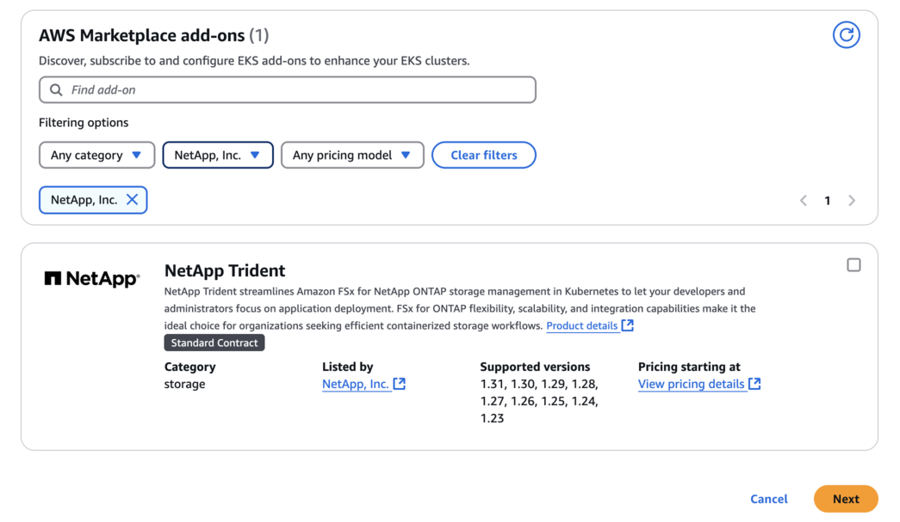

= Configure o complemento Trident EKS em um cluster EKS.
:hardbreaks:
:allow-uri-read: 
:icons: font
:imagesdir: ../media/

[role="lead"]
O NetApp Trident simplifica o gerenciamento de armazenamento do Amazon FSx for NetApp ONTAP no Kubernetes, permitindo que seus desenvolvedores e administradores se concentrem na implantação de aplicativos.  O complemento NetApp Trident EKS inclui os patches de segurança e correções de bugs mais recentes, e é validado pela AWS para funcionar com o Amazon EKS.  O complemento EKS permite garantir de forma consistente que seus clusters Amazon EKS estejam seguros e estáveis, além de reduzir o trabalho necessário para instalar, configurar e atualizar complementos.

== Pré-requisitos

Certifique-se de ter o seguinte antes de configurar o complemento Trident para AWS EKS:

* Uma conta de cluster Amazon EKS com permissões para trabalhar com complementos. Consultelink:https://docs.aws.amazon.com/eks/latest/userguide/eks-add-ons.html["Complementos do Amazon EKS"^] .
* Permissões da AWS para o marketplace da AWS:
`"aws-marketplace:ViewSubscriptions",
"aws-marketplace:Subscribe",
"aws-marketplace:Unsubscribe`
* Tipo de AMI: Amazon Linux 2 (AL2_x86_64) ou Amazon Linux 2 Arm (AL2_ARM_64)
* Tipo de nó: AMD ou ARM
* Um sistema de arquivos Amazon FSx for NetApp ONTAP

== Passos

. Certifique-se de criar uma função do IAM e um segredo da AWS para permitir que os pods do EKS acessem os recursos da AWS.  Para obter instruções, consultelink:../trident-use/trident-fsx-iam-role.html["Crie uma função do IAM e um segredo da AWS."^] .
. No seu cluster Kubernetes EKS, navegue até a guia *Complementos*.
+
image::../media/aws-eks-01.png[aws eks 01]

. Acesse os complementos do *AWS Marketplace* e escolha a categoria _armazenamento_.
+

. Localize * NetApp Trident*, selecione a caixa de seleção do complemento Trident e clique em *Avançar*.
. Escolha a versão desejada do complemento.
+
image::../media/aws-eks-03.png[aws eks 03]

. Configure as configurações necessárias do complemento.
+
image::../media/aws-eks-04.png[aws eks 04]

. Se você estiver usando o IRSA (funções do IAM para conta de serviço), consulte as etapas de configuração adicionais.link:https://docs.netapp.com/us-en/trident/trident-use/trident-fsx-install-trident.html#enable-the-trident-add-on-for-aws["aqui"] .
. Selecione *Criar*.
. Verifique se o status do complemento é _Ativo_.
+
image::../media/aws-eks-05.png[aws eks 05]

. Execute o seguinte comando para verificar se o Trident está instalado corretamente no cluster:
+
[listing]
----
kubectl get pods -n trident
----
. Continue a configuração e configure o backend de armazenamento. Para obter informações, consultelink:../trident-use/trident-fsx-storage-backend.html["Configure o backend de armazenamento"^] .

== Instale/desinstale o complemento Trident EKS usando a CLI.

.Instale o complemento NetApp Trident EKS usando a CLI:
O comando de exemplo a seguir instala o complemento Trident EKS:
`eksctl create addon --cluster clusterName --name netapp_trident-operator --version v25.6.0-eksbuild.1` (com uma versão dedicada)

.Desinstale o complemento NetApp Trident EKS usando a CLI:
O comando a seguir desinstala o complemento Trident EKS:

[listing]
----
eksctl delete addon --cluster K8s-arm --name netapp_trident-operator
----